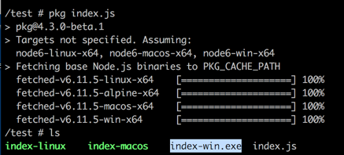

# Node2Executable
Package your Node.js into an Cross Platform Executable

## Package your Node.js project into an executable using https://npmjs.com/pkg

	//Test Code index.js

	var http = require("http");
	http.createServer(function (request, response) {
	   // Send the HTTP header
	   // HTTP Status: 200 : OK
	   // Content Type: text/plain
	   response.writeHead(200, {'Content-Type': 'text/plain'});
		// Send the response body as "Hello World"
	   response.end('Hello World\n');
	}).listen(8081);

	// Console will print the message
	console.log('Server running at http://127.0.0.1:8081/');

Save this content on a index.js file and compile on a Linux Alpine (over Docker) ☺
 

 
You will be get the binary files ready to run over Linux, mac and windows.
 
We copy the index-win.exe to a Windows 10 machine (deployed over Virtualbox, sorry, I’m are working on Mac OS)

Execute the .exe and try with your favorite (or existing) browser.

Next Steps: Develop auto-content cross platform microservices without publish your source code.
